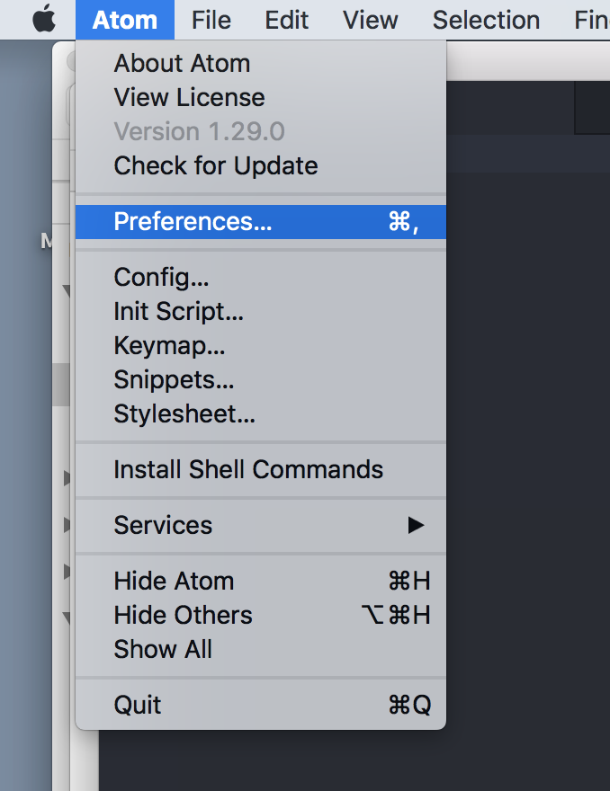
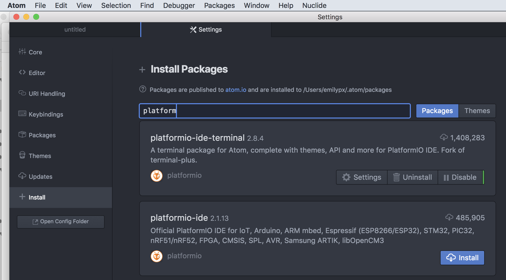
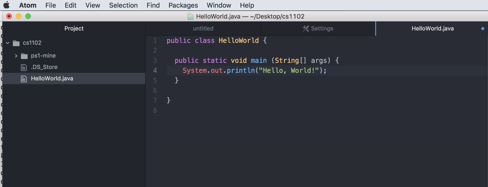
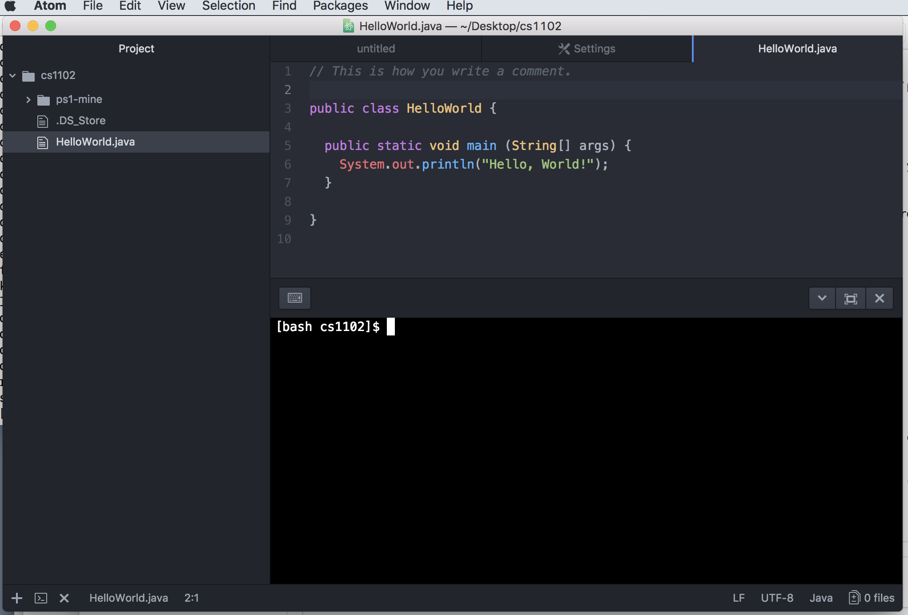

# Problem Set 0.5

# Is the Best

## Due Friday, August 31, at 11:59pm local time

### Part 1: Access the Problem Set

1. Create a folder on your computer for this class called CS2 or CS1102. I have mine on my Desktop so it's easy to find.

2. By now you should have received an email with an invitation to accept Problem Set 0.5. If you didn't receive the email or can't find it, you can find the link on Canvas. Accept the invitation, and then download the associated repository as a zip file, move the zip to the folder you created in Step 1, and unzip it.

3. You now have the git repository ("repo") you need to complete the programming portion of the problem set, which will be described in part 5, below.

### Part 2: Install Java SE

1. Although there are several newer versions of Java, we'll be using Java 8. Download the Java SE Development Kit 8u181 (the last three numbers might be different, that's okay!) for your operating system from [here](http://www.oracle.com/technetwork/java/javase/downloads/jdk8-downloads-2133151.html).

2. After you download the dmg (Mac) or exe (Windows), double-click it to start the installation. Click where you need to click to complete the installation, and you should be all set. If something goes wrong, contact a TA.

### Part 3: Install the textbook library

1. Installing `algs4.jar`

One of the nice things about the Sedgewick and Wayne Algorithms book (which we'll call SW for short) is the extensive software library developed by the authors. The library is housed in the Java archive `algs4.jar`.  The simplest option for setting this up is to use the automated installation scripts developed by SW. **Note: Follow ONLY step 0, starting from the third bullet, of the instructions there**.

+ [MacOS](https://algs4.cs.princeton.edu/mac/)
+ [Windows](https://algs4.cs.princeton.edu/windows/)

Following the instructions **only for Step 0 starting from the third bullet** and executing the downloaded installer script on your computer will download the `algs4.jar` library for you (along with other tools).

2. Setting the `CLASSPATH` variable

Java needs to know where to look for libraries, like the `algs4.jar` file you just installed, that are not included with the Java installation. Java uses a special system environment variable called `CLASSPATH` to tell Java where to search for such libraries. The `CLASSPATH` variable needs to be set correctly in order to compile and run your Java code. Setting this variable varies depending on whether you are using MacOS or Windows.

#### MacOS

The easiest way to set the `CLASSPATH` is to use the *unix shell* that comes installed on MacOS in the Terminal app. You can find the Terminal app in your Applications folder, or you can search for it using Spotlight by clicking the magnifying glass in the upper right corner of the screen. Launch Terminal, and you'll see something like this:


Terminal provides a bash shell by default. The shell is waiting for you to type a unix command. You don't have to master unix for this course, but it would be helpful to study it if you aren't familiar with it. To learn more, Google a tutorial or follow along with the [very basic tutorial I use in my other classes](https://people.rit.edu/emilypx/lab1.html) (no need to turn it in, of course).

For now type **exactly** what is shown to the right of the `$` prompt. Feel free to copy and paste, but don't include the `$`!:

```bash
$ cd
$ echo "export CLASSPATH=\$CLASSPATH:/usr/local/algs4/algs4.jar" >> ~/.bashrc
$ source .bashrc
```

The first command makes your home directory (i.e.,  `/Users/yourusername/`) the current working directory. The second command appends a key line to your bash startup file (``.bashrc``) setting your `CLASSPATH` variable. The third command executes that startup file. That same startup file will be automatically executed each time you launch the Terminal app.

Confirm that Java is installed by typing

```bash
$ javac -version
```

you should see something like

```bash
javac 1.8.0_181          # it doesn't matter if the last 3 digits differ
```

Confirm that your `CLASSPATH` variable is properly defined by typing

```bash
$ echo $CLASSPATH
```

you should see something like

```bash
/usr/local/algs4/algs4.jar
```

If you have problems with any of these steps, reach out to a TA. If it worked, move on to Part 4 and skip over the Windows instructions, below.

#### Windows

What follows is a cribbed version of instructions specified on SW's algs4 website for adding the `algs4.jar` library to the `CLASSPATH` for Windows.

1. Windows 7: Start -> Computer -> System Properties -> Advanced system settings -> Environment Variables -> User variables -> CLASSPATH. Windows 8 and 10: Search -> System (Control Panel) -> Advanced system settings -> Environment Variables -> User variables -> CLASSPATH.

2. Prepend the following to the beginning of the `CLASSPATH` variable:

   ```bash
   C:\Users\username\algs4\algs4.jar;
   ```

   where `username` is **your username** on your computer. A semicolon separates entries in the `CLASSPATH` so don't forget include it when you paste in the above text.

3. Click OK three times.

*NOTE:* If you don't see a variable named `CLASSPATH`, click **New** and in the popup window enter `CLASSPATH` for the variable name. Then, perform the instructions above.

### Part 4: Install and configure Atom

In this course we'll be using GitHub's Atom editor to write our Java code, and we'll be using git and GitHub to distribute and collect problem sets. Fortunately, git and GitHub are nicely integrated into the Atom editor. You can find a lot of [video tutorials on using Atom](https://www.leveluptutorials.com/tutorials/atom-editor-tutorials) though you probably won't need much guidance since we'll be using only a small part of its functionality.

1. [Download Atom](https://atom.io). Double click the downloaded file unzip it (if necessary), then move Atom to a place on your computer where it will be easy to find (e.g., in the Applications folder or on your desktop).

2. Launch Atom. There are a few tabs or frames that open automatically, which you can close by clicking the "X" in the upper right corner of the tab or frame.

3. You now need to install an Atom package that will customize Atom for use in this class. From Atom's menu bar, click the Atom menu, and then select Preferences to open the Settings menu. You can also access the settings via a keyboard shortcut: in MacOS hold down the ``command``key and type a comma; in Windows, hold down the ``control`` key and type a comma.



4. On the left of the Settings area, you’ll see a menu with items like Core, Editor, URI Handling and so on. Click on the menu item that says Install, which has a plus-sign icon next to it.



5. In the search box that appears, enter ``platformio-ide-terminal``. Click Install button for ``platform-ide-terminal``, and wait for installation to complete.

### Part 5:

1. In Atom, go to `File -> Open`, and navigate to your class folder, then to the unzipped folder you downloaded from GitHub for this class. Select the file called `HelloWorld.java`.

2. You should now see something like this, below, with a structure showing the files in your current directory in the left pane and an editor containing the Java code on the right.




3. In the panel with the code, you'll see this line:

```bash
System.out.println("Hello, World!")
```

Replace the words ``Hello, World!`` with your favorite greeting.

4. From the ``File`` menu, select ``Save`` (or use your usual keyboard shortcut for saving, like command-s in MacOS or control-s in Windows).

5. From Atom's ``Packages`` menu, select ``platformio-ide-terminal -> New Terminal``. Atom will now look something like this, with a terminal where you can type commands:



6. In the terminal window that just opened, type the

```bash
[bash cs1102]$ javac HelloWorld.java
```
